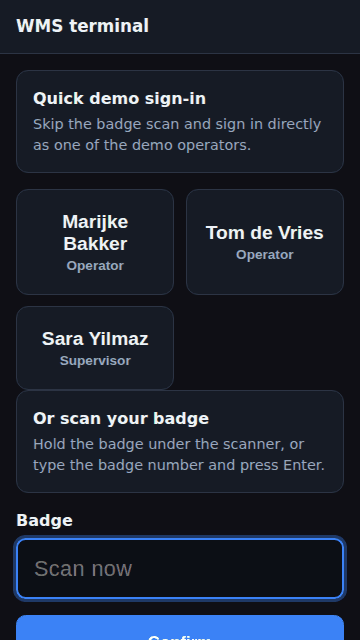
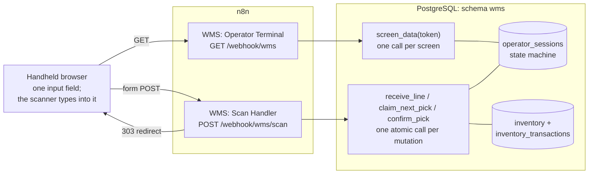
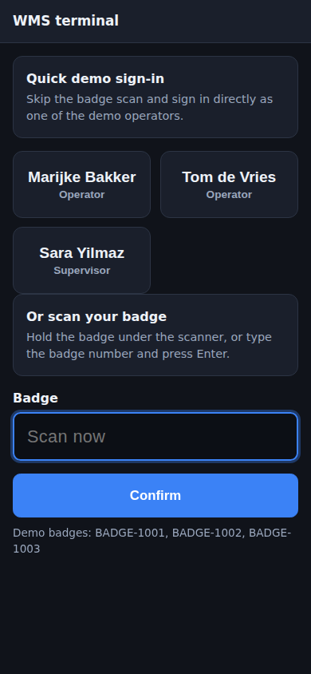
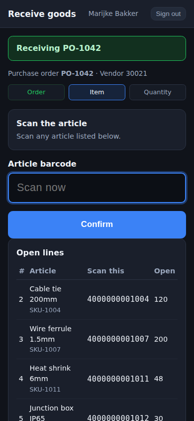
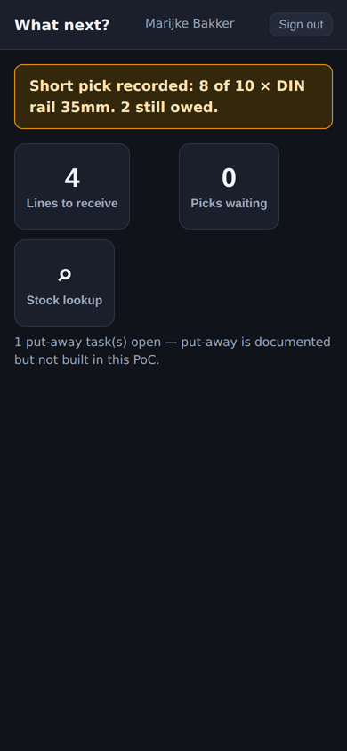

# n8n-wms

[](https://github.com/remkostas/n8n-wms/actions/workflows/ci.yml)

**A barcode-driven warehouse terminal built on n8n and PostgreSQL, and a measured answer to whether you should build one.**

I built a working warehouse management system to test a product idea: a self-hosted WMS for small warehouses, with n8n as the workflow engine and UI server, PostgreSQL as the only system of record, and handheld scanners on the floor. Then I measured it and decided not to sell it.

- **Technically it works.** Receiving, picking with short picks, stock lookup, badge sign-in, and sessions that survive a page reload or a switch to another device mid-task. It stays correct under contention: 10 operators receiving the same article at once, 400 receipts in all, leave the ledger and stock in exact agreement.
- **Commercially it doesn't.** n8n's licence rules out shipping it as a product, ERPNext already gives small warehouses a free and mature alternative, and "customisable without developers" fell apart as soon as the logic had to move into SQL.



## What's interesting here

**n8n can't hold a database transaction across nodes,** and every stock movement is at least two writes that must never disagree. So each mutation is one `plpgsql` call ([`db/02-functions.sql`](db/02-functions.sql)), and n8n only routes requests and renders screens. More than half the code ended up in SQL (55 % here, 61 % at evaluation). That's the main finding: the canvas stays small (5 + 17 nodes), but the business logic doesn't live on it.

**The test suite passed while the app was unusable in a browser.** n8n serves webhook HTML inside a CSP sandbox that drops cookies on form POSTs, and curl doesn't enforce CSP. The write-up, and how the terminal now works on a stock instance by carrying the session token in URLs and form fields, is in [docs/csp-sandbox.md](docs/csp-sandbox.md).

**The first benchmark flattered it.** Probe workflows put a scan at 36 ms, with room for about 85 operators. The finished terminal runs two executions and 16 nodes per scan: about 130 ms, and roughly 25–35 operators before the tail gets long. That's still fine for a small warehouse, but it's a third of the headroom I'd originally claimed ([docs/BENCHMARK.md](docs/BENCHMARK.md)).

## How it works



Every scan is POST → 303 → GET. Reloading the page only ever repeats a read, which is why recovery after a reload needs no special handling. The operator's state (which screen, what has been scanned so far) lives in `operator_sessions`, not in the browser or in n8n's execution data, so a task carries on on another device.

## Run it

Needs Docker, plus `curl`, `jq` and `python3` for the setup script.

```bash
cp .env.example .env              # set POSTGRES_PASSWORD and N8N_ENCRYPTION_KEY
docker compose up -d
scripts/setup.sh                  # owner account, credential, workflows; no UI clicks
```

Open **http://localhost:5678/webhook/wms** and sign in as one of the demo operators. A two-minute tour:

1. Lines to receive → scan `PO-1042` → scan `4000000001007` → enter `25`
2. Reload the page halfway through. Nothing is lost.
3. Picks waiting → work through the tasks. The third asks for 10 DIN rails where only 8 are on the shelf; enter `8` and it records a short pick.

| Sign in | Receiving | After a short pick |
|:---:|:---:|:---:|
|  |  |  |

The full reference data and a 10-minute demo script are in [docs/TEST-CASES.md](docs/TEST-CASES.md). To open it from a phone, set `N8N_BIND` in `.env` to an address the phone can reach, and change `N8N_OWNER_PASSWORD` too: the demo one is published here, and it unlocks the n8n editor, which can run arbitrary code. `setup.sh` refuses to continue until you do.

## Test it

```bash
node --test tests/unit/*.test.js  # 42 unit tests of the Code-node logic; no stack needed
tests/walkthrough.sh              # 73 checks: screens and database, resets itself
bench/bench.py contention         # 20 operators, 400 receipts of one article: must reconcile exactly
```

The acceptance test drives the terminal over HTTP the way a browser does and checks the database after every mutation. It resets the `wms` schema, so don't run it while someone is using the terminal.

[CI](.github/workflows/ci.yml) runs all three on every push: lint and unit tests, then the real compose stack from scratch, `setup.sh`, the full acceptance test and a 100-receipt contention run.

## Repository

| Path | What |
|---|---|
| `db/` | Schema, the 11 `plpgsql` functions, demo data. Applied on first start |
| `src/terminal/` | The JavaScript that runs inside n8n's Code nodes, kept as real files so it can be reviewed |
| `workflows/` | Workflow templates; `scripts/build_workflows.py` injects `src/` into them |
| `scripts/` | `setup.sh` (install via the n8n API), `reset-db.sh` (back to demo data) |
| `tests/` | The acceptance test, and unit tests for the Code-node logic (`tests/unit/`) |
| `bench/` | Load and contention benchmark, standard library only |
| `.github/workflows/` | CI: ShellCheck, unit tests, then the whole stack end to end |
| `CLAUDE.md` | Working notes for coding agents: the rules that aren't obvious from the code |
| `docs/` | [Feasibility](docs/FEASIBILITY.md), [benchmark](docs/BENCHMARK.md), [CSP sandbox](docs/csp-sandbox.md), [commercial conclusion](docs/COMMERCIAL.md), [test cases](docs/TEST-CASES.md) |

## What I'd do differently

- **Put a real browser in the test loop from day one.** The CSP bug cost hours, and checking one request in DevTools would have found it in minutes.
- **Benchmark the real thing earlier.** Probe workflows were the right way to decide quickly whether the idea was viable, but they made the finished system look faster than it is.
- **Keep the source in git before tearing anything down.** When I deleted the evaluation stack, its source went with it. This repo was rebuilt from the workflows still running in production and a schema dump. Diffing the rebuilt schema against the dump shows the recovery is exact.
- **Settle the licence question first.** It ended the product idea regardless of how good the technical result was, and it would have taken an afternoon to read.

## Not built

A put-away completion screen (the SQL function exists), packing and labels, cycle counts, ERP and carrier integration, offline mode, role enforcement, and testing on physical scanner hardware.

## Licence

MIT for the code and docs in this repo. n8n isn't included; it's distributed by n8n GmbH under the [Sustainable Use License](https://github.com/n8n-io/n8n/blob/master/LICENSE.md), which is exactly what [docs/COMMERCIAL.md](docs/COMMERCIAL.md) is about.
